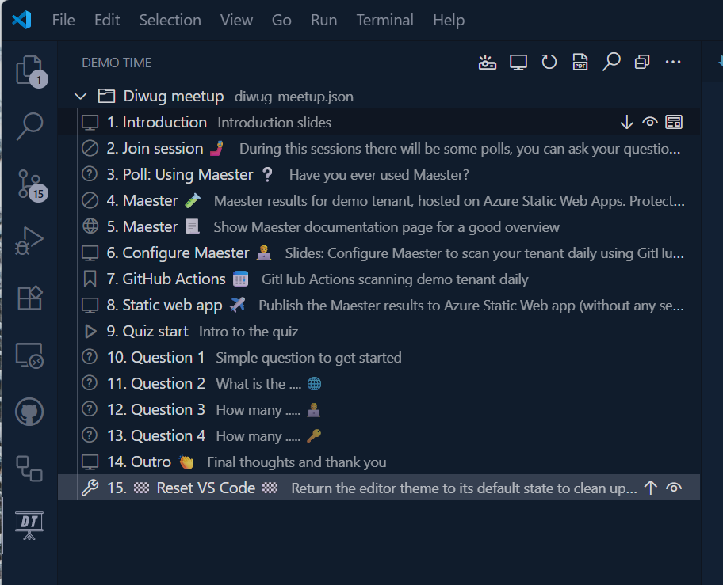
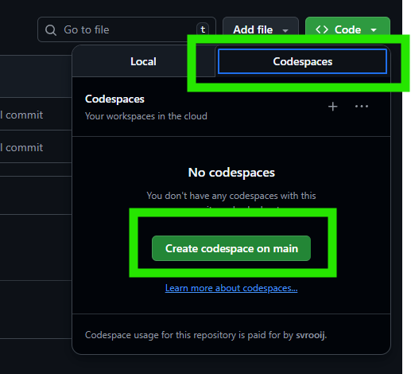
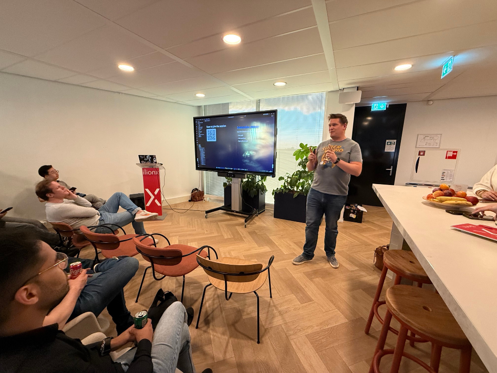

# Maester demo

Repository with the Maester demo by [Stephan van Rooij](https://svrooij.io).

## ▶️ Replay demo

You can replay the demo by checking out this repository, installing [DemoTime](https://demotime.show) (which should happen automatically) and starting any step of the demo by clicking it:

### 💻 Codespace

This repository is configured to run in GitHub Codespaces, so you can also open it in a codespace and run the demo from there.

## 📖 Resources

- [Maester website](https://maester.dev) 📕
- [Static web app config](./config//staticwebapp.config.json) 🔑
- [Workflow with SWA deploy](./.github/workflows/maester.yml) ⚙️

### Other links

- [Blog Stephan](https://svrooij.io) 🧑‍🏫
- [WinTuner](https://wintuner.app) 📦
- [Graph X Ray](https://graphxray.merill.net) ⚡
- [DemoTime](https://demotime.show) 🖥️ & [Engage Time](https://engagetime.live/) 🤳

## 🧑‍🏫 Talks

### 📅 2025-10-18 Collab days Belgium

I gave this demo at [Collab days Belgium](https://www.collabdays.org/2025-belgium/) in Edegem, Belgium. [event link](https://engagetime.live/conference/collabdays-belgium-2025)

### 📅 2025-09-23 Diwug 

I gave this demo at a [Diwug](https://diwug.nl) meetup in Utrecht, The Netherlands. [event link](https://www.meetup.com/nl-NL/dutch-information-workers-user-group-diwug/events/310762820/)

+/- 40 people attended for this interactive demo with a lot of interaction.

## Maester demo at your event?

Want to see this demo at your event? Reach out!
